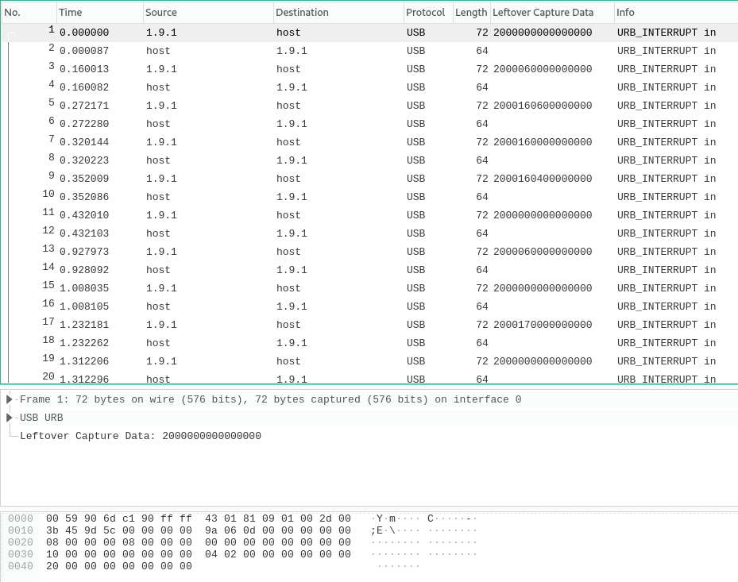

# Monkey
## Forensics, 68 points

### Prompt

Have you ever heard of the Infinite Monkey Theorem?
Anyway, we have a pcap. Can you retrieve the flag from it?

### Solution

**NOTE: I learned how to do all of this stuff from [this](https://medium.com/@ali.bawazeeer/kaizen-ctf-2018-reverse-engineer-usb-keystrok-from-pcap-file-2412351679f4) amazing tutorial.**

If you open up the `.pcap` file, you will see that most of the captured traffic is from USB. This probably means that the captured packets are keystrokes on the keyboard.



I've seen these problems before but have never solved one, so I Googled things about how to interpret USB traffic on Wireshark, and found this [article](https://medium.com/@ali.bawazeeer/kaizen-ctf-2018-reverse-engineer-usb-keystrok-from-pcap-file-2412351679f4).

Based on the article, I exported all the USB data to a `.csv` file by filtering the data with `usb.transfer_type == 0x01 && frame.len == 72` and then exporting the selected frames:

```
"No.","Time","Source","Destination","Protocol","Length","Leftover Capture Data","Info"
"1","0.000000","1.9.1","host","USB","72","2000000000000000","URB_INTERRUPT in"
"3","0.160013","1.9.1","host","USB","72","2000060000000000","URB_INTERRUPT in"
"5","0.272171","1.9.1","host","USB","72","2000160600000000","URB_INTERRUPT in"
"7","0.320144","1.9.1","host","USB","72","2000160000000000","URB_INTERRUPT in"
"9","0.352009","1.9.1","host","USB","72","2000160400000000","URB_INTERRUPT in"
"11","0.432010","1.9.1","host","USB","72","2000000000000000","URB_INTERRUPT in"
"13","0.927973","1.9.1","host","USB","72","2000060000000000","URB_INTERRUPT in"
"15","1.008035","1.9.1","host","USB","72","2000000000000000","URB_INTERRUPT in"
.
.
.
```

I then ran `awk -F "\"*,\"*" '{print $7}' data.csv > hex.txt` to get just the data from the `Leftover data` columm.

Then, based on what the article said each keystroke was represented as, I wrote a small Python script to print out the keystrokes:

```python
newmap = {
 4: "a",
 5: "b",
 6: "c",
 7: "d",
 8: "e",
 9: "f",
 10: "g",
 11: "h",
 12: "i",
 13: "j",
 14: "k",
 15: "l",
 16: "m",
 17: "n",
 18: "o",
 19: "p",
 20: "q",
 21: "r",
 22: "s",
 23: "t",
 24: "u",
 25: "v",
 26: "w",
 27: "x",
 28: "y",
 29: "z",
 30: "1",
 31: "2",
 32: "3",
 33: "4",
 34: "5",
 35: "6",
 36: "7",
 37: "8",
 38: "9",
 39: "0",
 40: "Enter",
 41: "esc",
 42: "del",
 43: "tab",
 44: "space",
 45: "-",
 47: "[",
 48: "]",
 56: "/",
 57: "CapsLock",
 79: "RightArrow",
 80: "< "
}

myKeys = open('hexoutput.txt', 'r')
result = ''

for line in myKeys:
    bytesArray = bytearray.fromhex(line)

    for byte in bytesArray:
        if byte != 0:
            keyVal = int(byte)
            if keyVal in newmap:
                result += newmap[keyVal]

print(result)
```

After running the script I got the following output:

```
33c3sc3s3sa33c33t33f3[the-inffiinitete-monkeeyy-theorerem]< < < < del0< < < < < < < < < del0< < < < < del1< < del1< < < del1
```

Ignoring the rogue `3`s and interpreting the `<` as a backspace, I recreated the keystrokes to get the flag: `CSACTF{the_1nf1n1te_m0nkey_the0rem}`
