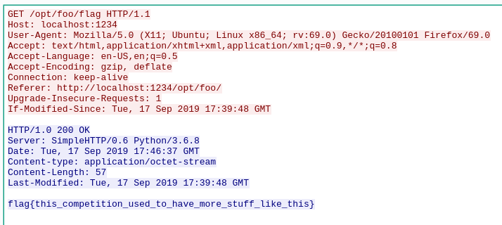

# Cappy
## Forensics, ? points

### Prompt

I don't have the original prompt, but we were given the file `cappy.pcap`.

### Solution

We are given a `.pcap` file, so I opened it in Wireshark. As I scrolled through the file, I saw a GET request that was requesting a file called `flag`. I followed the HTTP stream, and the flag was in the response: `flag{this_competition_used_to_have_more_stuff_like_this}`. 

