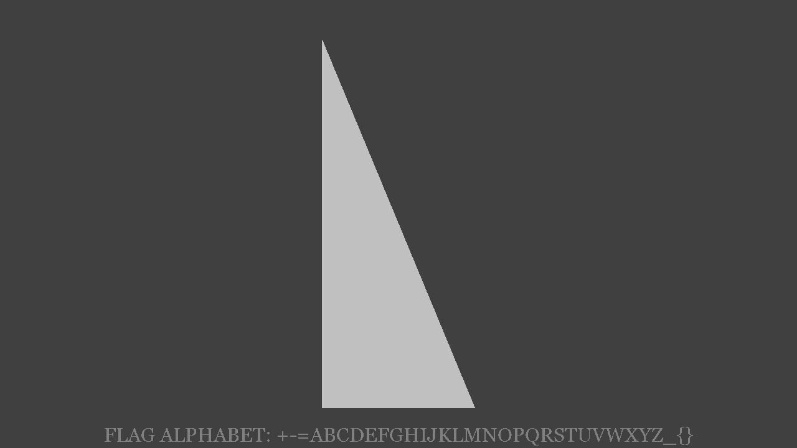

# redacted-puzzle
## Potpourri, 110 points

### Prompt

Everything you need is in this file.

Attached: `redacted-puzzle.gif`

### Solution

The GIF looks blank, but after some fiddling with it in StegSolve (or GIMP) you can change the color map and are able to see the actual frames. (A teammate made a gray version, `redacted-puzzle-gray.gif`, which is what I'll use from here on out).

Looking at the GIF, it's a bunch of weird shapes and a string at the bottom that has an alphabet:



There are 32 characters in the alphabet, so my first guess was that the shapes were touching the vertices of some 32-pointed shape and that would help with getting the flag. I sped up the GIF to see if I could find anything:


It was pretty clear now that it was an octagon, not a 32-pointed shape, and it turned 1/8th of turn in the GIF.

In order to split it into the actual frames, I ran `convert -coalesce redacted-puzzle-gray.gif target.png`. It looked like the vertices of each shape must represent one of the 8 possible vertices in the octagon. I guessed that if the shape was touching a vertex, it was a 1, and otherwise a 0.

So this frame would be `10001100`:


I repeated this manually (yes I'm sure there was a better way but oh well) for all of the frames and got these 8-bit binary strings:

```
10001100
01100011
11100100
01000110
10000101
00111101
01000010
10011000
11100000
11110100
10000000
00101101
01110010
00011100
00001000
10100101
11010111
01101110
10100110
10010001
10111100
10000100
10000001
10111001
11010100
00111011
11001110
11110010
00011110
10011101
11001001
11000111
01100101
00011110
10011111
```

I tried interpreting them directly as ASCII but just got gibberish. After a lot of fiddling, I figured out you have to concatenate them all together, and then split them into 5 bit chunks. You only needed 5 because there were only 32 letters in the alphabet they gave us, which can be represented in 5 bits (2^5 = 32). Then the 5 bit chunks could be interpreted as indices into the alphabet, and could be used to get the flag:

```python
alphabet = '+-=ABCDEFGHIJKLMNOPQRSTUVWXYZ_{}'
bits = '1000110001100011111001000100011010000101001111010100001010011000111000001111010010000000001011010111001000011100000010001010010111010111011011101010011010010001101111001000010010000001101110011101010000111011110011101111001000011110100111011100100111000111011001010001111010011111'

index = 0
result = ''

while index < len(bits):
    chunk = int(bits[index:index+5], 2)
    result += alphabet[chunk]
    index += 5

print(result)
```

Then we get the flag: `OOO{FORCES-GOVERN+TUBE+FRUIT_GROUP=FALLREMEMBER_WEATHER}`
