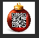

# Censored
## Misc

### Prompt

I don't have the original prompt, but we were given the `censored.jpg` file.

### Solution

If we open the `censored.jpg` file, there's an ornament with a blurred square in the middle, and what looks like a QR code underneath.

I ran `file` on the picture, to see if there was anything interesting I could figure out:

```shell
→ file censored.jpg
censored.jpg: JPEG image data, Exif standard: [TIFF image data, little-endian,
direntries=7, description=Censored by Santa!, xresolution=118, yresolution=126,
resolutionunit=2, software=GIMP 2.10.12, datetime=2019:12:24 00:00:00], comment:
"Censored by Santa!", progressive, precision 8, 256x256, components 3
```

It said that this image was made in GIMP, which usese `.xcf` files. I figured that if I converted this to an `.xcf` file, I might be able to figure out more:

```shell
cp censored.jpg censored.xcf
```

The good news was that I didn't have to do much else; when I did that the file preview showed the QR code clearly (although it was rather small):



Using an online QR code scanner, I was able to recover the flag: `HV19{just-4-PREview!}`.

I actually have no idea how or why this worked. I tried to do some Googling, but didn't find much. If anyone has any more insight as to why this works, please let me know!!!
