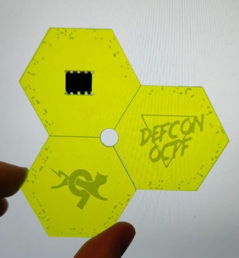

# tinyhw0
## Hardware, 38 points

## Prompt

## Solution

We were given this acrylic... thing as the prompt. There were little etchings around the perimeter of the 3 hexagons, and the edges between each hexagon were also scored. We decided (after much argument) to snap the shape into three individual hexagons. When you laid the 3 parts on top of each other, you could read out the flag (unfortunately we don't have a picture): `flag{4_the_lulz}`.
