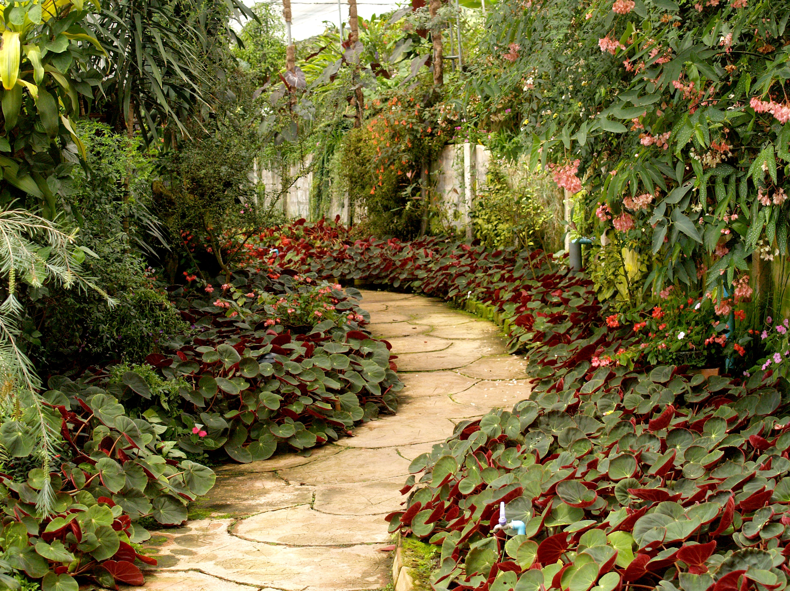

# Glory of the Garden
## Forensics, ? points

### Prompt



### Solution

The file itself was just a picture of a garden, so there wan't anything useful there. I ran `file` on the image, also to no avail:

```shell
→ file garden.jpg
garden.jpg: JPEG image data, JFIF standard 1.01, resolution (DPI), density 72x72, segment length 16, baseline, precision 8, 2999x2249, components 3
```

The next step on my mental checklist was to run `strings` and `grep` for the flag:
```shell
→ strings garden.jpg | grep picoCTF
Here is a flag "picoCTF{more_than_m33ts_the_3y364513C7F}"
```

Flag: `picoCTF{more_than_m33ts_the_3y364513C7F}`.
