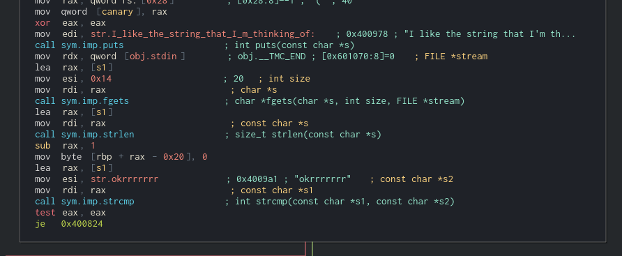
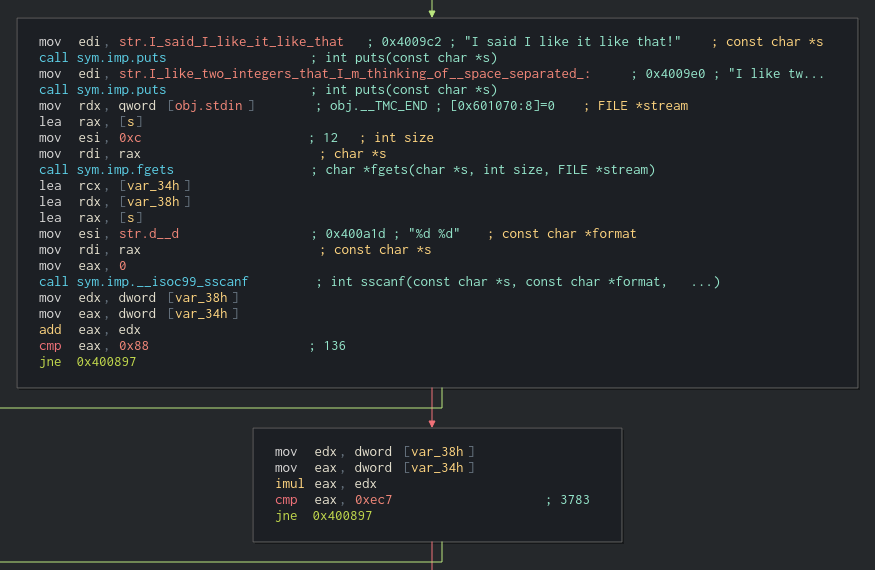

# I Like It
## Reversing, 40 points

### Prompt

Now I like dollars, I like diamonds, I like ints, I like strings. Make Cardi like it please.

`/problems/2019/i_like_it`

*Author: SirIan*

### Solution

If you run the given binary, it will ask for a string, and exit the program if you provide the wrong one.

```
→ ./i_like_it
I like the string that I'm thinking of:
asdf
Cardi don't like that.
```

After opening the binary in Cutter, you can find the first part that checks for the right string.



You can see in the disassembled program and Cutter's annotations that the program is comparing whatever we input with `okrrrrrrr`, which must be the first string.

```
→ ./i_like_it                             
I like the string that I'm thinking of:
okrrrrrrr
I said I like it like that!
I like two integers that I'm thinking of (space separated):
1 2
Cardi don't like that.
```

After inputting the correct string, we see that the next task is to give the program 2 integers. Moving over to the appropriate function in the disassembled binary, we see this:



After taking in the two integers and storing them in `eax` and `edx`, they are added together and compared to 136. So that means our two numbers must add up to 136. The next step is to multiply the two integers together, and then compare that to 3783. So we need to find two numbers that add to 136 and multiply to 3783. Instead of writing a script to find this number, I just went to WolframAlpha and fount the roots for the equation x<sup>2</sup> + 136x + 3783 (the two roots have to add to 136 and multiply to 3783). The result is 39 and 97.

```
→ ./i_like_it
I like the string that I'm thinking of:
okrrrrrrr
I said I like it like that!
I like two integers that I'm thinking of (space separated):
39 97
I said I like it like that!
Flag: actf{okrrrrrrr_39_97}
```

Run the program with that and we get our flag: `actf{okrrrrrrr_39_97}`
