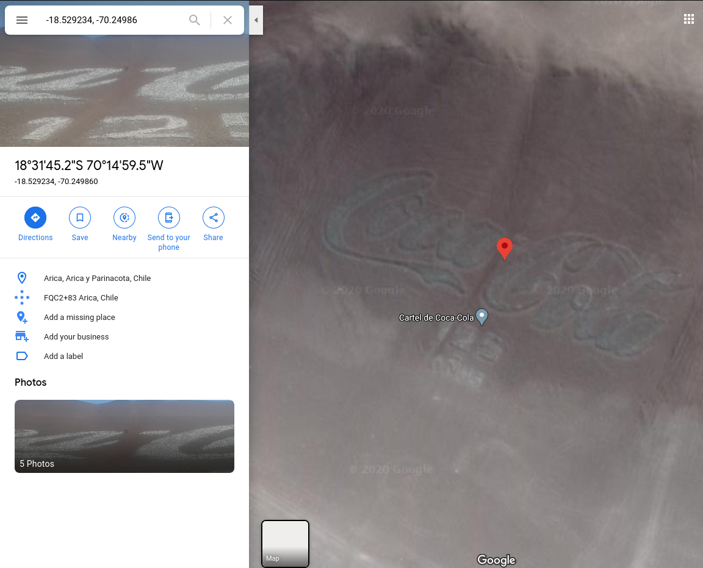

# Geography
## Misc, 304 points

### Prompt

My friend told me that she found something cool on the Internet, but all she sent me was 11000010100011000111111111101110 and 11000001100101000011101111011111.

She's always been a bit cryptic. She told me to "surround with gigem{} that which can be seen from a bird's eye view"... what?

### Solution
Since the title is Geography, I assumed that the two numbers were probably a latitude and longitude value. If you convert them from binary to a floating point number, you get:

```
-70.24986
-18.529234
```

If you go to Google Maps and plug in these coordinates, you will see that the mountains have Coca Cola printed in them:



The flag is just `gigem{coca-cola}`.
