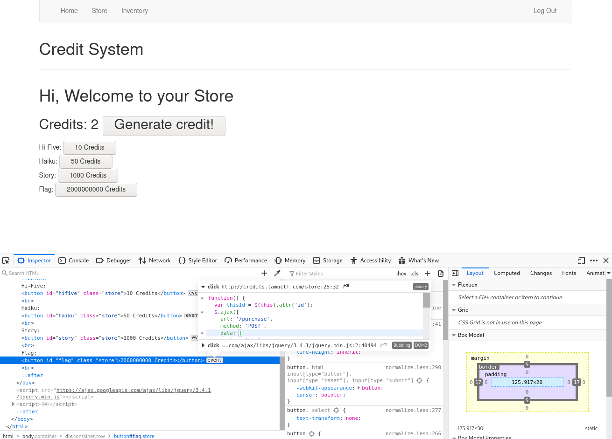
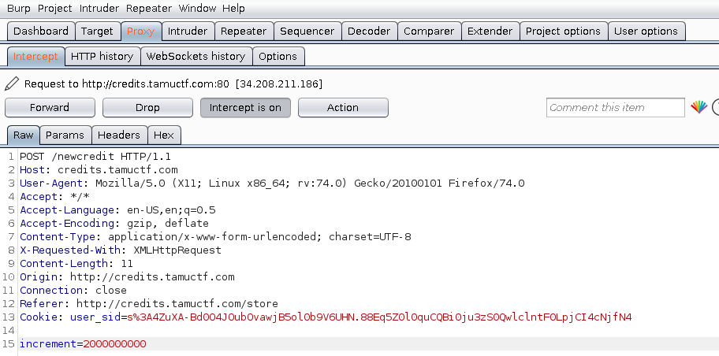
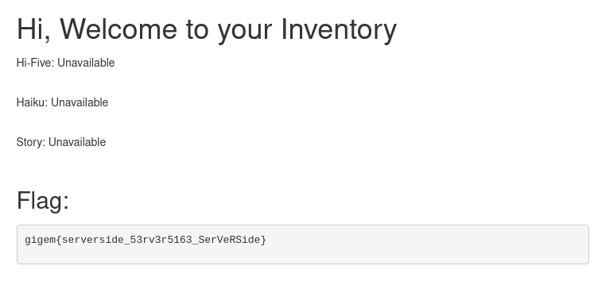

# Credits
## Web, 50 points

### Prompt

Try testing out this new credit system that I just created!

http://credits.tamuctf.com/

Hint: Credit generation is rate limited. It is literally impossible to generate 2,000,000,000 credits within the CTF timeframe. Don't be that guy.

### Solution
If you go to the website, you are presented with a website that lets you generate credits. If you look at the button to buy the flag, you will see that you need 2,000,000,000 credits. You can also see that it sends a POST request to purchase that flag:

I tried messing with that request, but in the end, I ended up intercepting the request to generate credits with BurpSuite and changing it to give me 2,000,000,000 credits instead of 1:

Now that I have enough credits, I can buy the flag:

Flag: `gigem{serverside_53rv3r5163_SerVeRSide}`.
