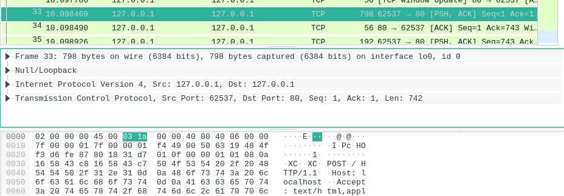
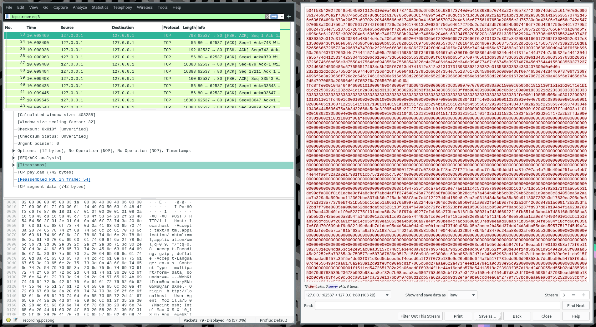
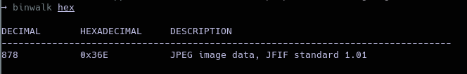

# ws2
## Misc, 80 points

### Prompt

No ascii, not problem :)

*Author: JoshDaBosh*

### Solution

We are given a `.pcap` file, so I opened it in Wireshark. There was a lot of TCP traffic, and as I scrolled through them, I found one with a POST request:

I did followed the TCP stream for that packet, turned it into raw hex and got this:

I copied the raw hex into a file, but when I ran `file` on it, it was just data. So I tried `binwalk` and found that there was an image inside:

I then extracted the image with `dd if=hex of=result.jpg skip=878 bs=1`, and opened the image to get the flag: `actf{ok_to_b0r0s-4809813}`

